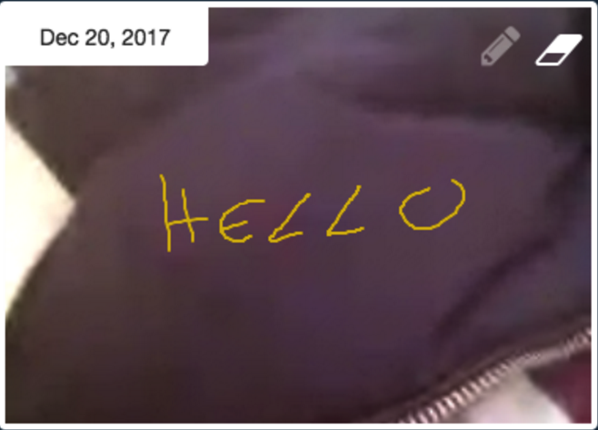

# ng2-canvas-whiteboard

Add a canvas component which the user can draw on. The coordinates are drawn as a percentage of the containers width and height.
To reuse them anywhere, they need to be remapped (multiply the received x and y coordinates with their width and height accordingly)


# Install

1. Install npm module:

    ```bash
    npm install ng2-canvas-whiteboard --save
    ```
    
2. If you are using system.js you may want to add this into `map` and `package` config:

    ```json
    {
        "map": {
            "ng2-canvas-whiteboard": "node_modules/ng2-canvas-whiteboard"
        },
        "packages": {
            "ng2-canvas-whiteboard": { "main": "index.js", "defaultExtension": "js" }
        }
    }
    ```
    
Add the module to your project

```typescript
@NgModule({
    imports: [
        CanvasWhiteboardModule
    ]
    ...
)}
```

In your component, you should add the CanvasWhiteboardComponent as a view provider
```typescript
@Component({
    selector: '...',
    viewProviders: [CanvasWhiteboardComponent],
    templateUrl: '...'
})
```

In the html file, you can insert the Canvas Whiteboard

```html
<canvas-whiteboard #canvasWhiteboard class=""
                       [imageUrl]="url"
                       [aspectRatio]="getAspectRatio()"
                       [drawButtonClass]="'drawButtonClass'"
                       [clearButtonClass]="'clearButtonClass'"
                       (onBatchUpdate)="sendBatchUpdate($event)"
                       (onClear)="clearImage()">                    
</canvas-whiteboard>
```

#Drawing on the canvas

The canvas drawing is triggered when the user touches the canvas, draws (moves the mouse or finger) and then stops drawing.
When the drawing is started, after 100 ms all the signals in between are added to a list and are sent as a batch signal which is 
emitted by the **onBatchUpdate** emitter. If received, the user can then manipulate with the sent signals.

#Inputs
###imageUrl: string (optional)
The path to the image. If not specified, the drawings will be placed on the background color of the canvas

###aspectRatio: number (optional)
If specified, the canvas will be resized according to this ratio

####drawButtonClass: string <br/>clearButtonClass: string
The classes of the draw and clear buttons. Since the buttons do not contain any text, these classes are used in "\<i>"
tags. <br/>
Example:  
```html
     [drawButtonClass]="'fa fa-pencil fa-2x'"
     [clearButtonClass]="'fa fa-eraser fa-2x canvas_whiteboard_button-clear'"
   ```
####drawButtonEnabled: boolean (default: true) <br/>clearButtonEnabled: boolean (default: true)
Specifies whether or not the button for drawing or clearing the canvas should be shown.

##Event emitters
```typescript
 @Output() onClear = new EventEmitter<any>();
 @Output() onBatchUpdate = new EventEmitter<CanvasWhiteboardUpdate[]>();
 @Output() onImageLoaded = new EventEmitter<any>();
```
**onClear** is emitted when the canvas has been cleared. <br/>
**onImageLoaded** is emitted if the user specified an image and it has successfully been drawn on the canvas.

#Example of a drawn image
An example of a drawn image and shape on the canvas with additional css for the buttons and a date:



##Current limitations

- There is no undo / redo functionality yet.
- There is no color picker for drawing yet, the only supported color is **rgb(216, 184, 0)**.
- There are no pre-made shapes yet, only mouse / touch free drawing.