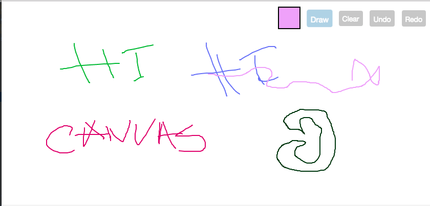
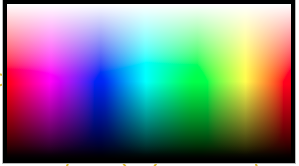

# ng2-canvas-whiteboard

Add a canvas component which the user can draw on. 
<br/>The coordinates are drawn as a percentage of the containers width and height.
<br/>To reuse them anywhere, they need to be remapped (multiply the received x and y coordinates with their width and height accordingly)

**Features:**<br/> 
- Supports touch.
- Supports UNDO/REDO.
- Implements a color picker.
- Sends outputs on every action.
- Contains inputs for multiple modifications.
- Save drawn images

# Install

1. Install npm module:

    ```bash
    npm install ng2-canvas-whiteboard --save
    ```
    
2. If you are using system.js you may want to add this into `map` and `package` config:

    ```json
    {
        "map": {
            "ng2-canvas-whiteboard": "node_modules/ng2-canvas-whiteboard"
        },
        "packages": {
            "ng2-canvas-whiteboard": { "main": "index.js", "defaultExtension": "js" }
        }
    }
    ```
    
Add the module to your project

```typescript
@NgModule({
    imports: [
        CanvasWhiteboardModule
    ]
    ...
)}
```

In your component, you should add the CanvasWhiteboardComponent as a view provider
```typescript
@Component({
    selector: '...',
    viewProviders: [CanvasWhiteboardComponent],
    templateUrl: '...'
})
```

In the html file, you can insert the Canvas Whiteboard

```html
<canvas-whiteboard #canvasWhiteboard
                     [drawButtonClass]="'drawButtonClass'"
                     [drawButtonText]="'Draw'"
                     [clearButtonClass]="'clearButtonClass'"
                     [clearButtonText]="'Clear'"
                     [undoButtonText]="'Undo'"
                     [undoButtonEnabled]="true"
                     [redoButtonText]="'Redo'"
                     [redoButtonEnabled]="true"
                     [colorPickerEnabled]="true"
                     [saveDataButtonEnabled]="true"
                     [saveDataButtonText]="'Save'"
                     [lineWidth]="5"
                     [strokeColor]="'rgb(0,0,0)'"
                     [shouldDownloadDrawing]="true"
                     (onBatchUpdate)="sendBatchUpdate($event)"
                     (onClear)="onCanvasClear()"
                     (onUndo)="onCanvasUndo($event)"
                     (onRedo)="onCanvasRedo($event)">
</canvas-whiteboard>
```

If there is too much overhead with inputs, you can just specify the [options] input, and specify the options from the typescript code

Example:
```html
<canvas-whiteboard #canvasWhiteboard
                   [options]="canvasOptions"
                   (onBatchUpdate)="onCanvasDraw($event)"
                   (onClear)="onCanvasClear()"
                   (onUndo)="onCanvasUndo($event)"
                   (onRedo)="onCanvasRedo($event)">
</canvas-whiteboard>
```
Code:
```typescript
  canvasOptions: CanvasWhiteboardOptions = {
    drawButtonEnabled: true,
    drawButtonClass: "drawButtonClass",
    drawButtonText: "Draw",
    clearButtonEnabled: true,
    clearButtonClass: "clearButtonClass",
    clearButtonText: "Clear",
    undoButtonText: "Undo",
    undoButtonEnabled: true,
    redoButtonText: "Redo",
    redoButtonEnabled: true,
    colorPickerEnabled: true,
    saveDataButtonEnabled: true,
    saveDataButtonText: "Save",
    lineWidth: 5,
    strokeColor: "rgb(0,0,0)",
    shouldDownloadDrawing: true
  };
```


# Drawing on the canvas

The canvas drawing is triggered when the user touches the canvas, draws (moves the mouse or finger) and then stops drawing.
When the drawing is started, after 100 ms all the signals in between are added to a list and are sent as a batch signal which is 
emitted by the **onBatchUpdate** emitter. If received, the user can then manipulate with the sent signals.

# Inputs
### batchUpdateTimeoutDuration: number (default: 100)
The time in milliseconds that a batch update should be sent after drawing.

### imageUrl: string (optional)
The path to the image. If not specified, the drawings will be placed on the background color of the canvas

### aspectRatio: number (optional)
If specified, the canvas will be resized according to this ratio

#### drawButtonClass: string <br/>clearButtonClass: string <br/>undoButtonClass: string <br/>redoButtonClass: string<br/>saveDataButtonClass: string
The classes of the draw, clear, undo and redo buttons. These classes are used in "\<i>" tags. <br/>
Example:  
```html
[drawButtonClass]="'fa fa-pencil fa-2x'"
[clearButtonClass]="'fa fa-eraser fa-2x canvas_whiteboard_button-clear'"
   ```
#### drawButtonEnabled: boolean (default: true) <br/>clearButtonEnabled: boolean (default: true) <br/>undoButtonEnabled: boolean (default: false)<br/>redoButtonEnabled: boolean (default: false)<br/>saveDataButtonEnabled: boolean (default: false)
Specifies whether or not the button for drawing or clearing the canvas should be shown.

#### drawButtonText, clearButtonText, undoButtonText, redoButtonText, saveDataButtonText
Specify the text to add to the buttons, default is no text
```html
[drawButtonText]="'Draw'"
[clearButtonText]="'Clear'"
```

##Use the options: CanvasWhiteboardOptions to send the inputs
Changes to this object will be detected by the canvas in the OnChange listener and will be changed accordingly
```typescript
  //Component
  canvasOptions: CanvasWhiteboardOptions = {
      drawButtonEnabled: true,
      drawButtonClass: 'drawButtonClass',
      drawButtonText: 'Draw',
      clearButtonEnabled: true,
      clearButtonClass: 'clearButtonClass',
      clearButtonText: 'Clear',
      undoButtonText: 'Undo',
      undoButtonEnabled: true,
      redoButtonText: 'Redo',
      redoButtonEnabled: true,
      colorPickerEnabled: true,
      saveDataButtonEnabled: true,
      saveDataButtonText: 'Save',
      lineWidth: 4
  };

   //View
  <canvas-whiteboard #canvasWhiteboard
                       [options]="canvasOptions"
                       (onBatchUpdate)="onCanvasDraw($event)"
                       (onClear)="onCanvasClear()"
                       (onUndo)="onCanvasUndo($event)"
                       (onRedo)="onCanvasRedo($event)"
                       (onSave)="onCanvasSave($event)">
  </canvas-whiteboard>
```

### To add text to the buttons via css
Each button has its on class (example: Draw button -> .canvas_whiteboard_button-draw)<br/>
This button can be customized by overriding it's css
```css
.canvas_whiteboard_button-draw:before {
  content: "Draw";
}
```
will add the "Draw" text to the button.

### colorPickerEnabled: boolean (default: false)
This allows the adding of a colorPicker that the user can choose to draw with and the original colors are kept when redrawing

### lineWidth: number (default: 2)
This input controls the drawing pencil size

### strokeColor: string (default: "rgb(216, 184, 0)")
This input control the color of the brush

### shouldDownloadDrawing: boolean (default: true)
This input control if the image created when clicking the save button should be downloaded right away.

If using component-only styles, for this to work the viewEncapsulation must be set to None.
```typescript
@Component({
  selector: 'app-root',
  templateUrl: './app.component.html',
  styleUrls: ['./app.component.css'],
  encapsulation: ViewEncapsulation.None
})
```

## Event emitters
```typescript
 @Output() onClear = new EventEmitter<any>();
 @Output() onBatchUpdate = new EventEmitter<CanvasWhiteboardUpdate[]>();
 @Output() onImageLoaded = new EventEmitter<any>();
 @Output() onUndo = new EventEmitter<any>();
 @Output() onRedo = new EventEmitter<any>();
 @Output() onSave = new EventEmitter<string | Blob>();
```
**onClear** is emitted when the canvas has been cleared. <br/>
**onImageLoaded** is emitted if the user specified an image and it has successfully been drawn on the canvas.
**onUndo** is emitted when the canvas has done an UNDO function, emits an UUID (string) for the continuous last drawn shape undone. <br/>
**onClear** is emitted when the canvas has done a REDO function, emits an UUID (string) for the continuous shape redrawn. <br/>
**onSave** is emitted when the canvas has done a SAVE function, emits a Data URL or a Blob (IE). <br/>

# Canvas Whiteboard Service
The ```CanvasWhiteboardService``` will be used by the canvas to listen to outside events.
The event emitters and ViewChild functionality will remain the same but with this service 
we can notify the canvas when it should invoke a specific action

Example:
```typescript
export class AppComponent {
  constructor(private _canvasWhiteboardService: CanvasWhiteboardService) {}
 
  public receiveNewMessage(newMessage: any): void {
     switch (newMessage.type) {
       case VCDataMessageType.canvas_draw:
         let updates = newMessage.data.map(updateJSON => CanvasWhiteboardUpdate.deserializeJson(JSON.parse(updateJSON)));
         this._canvasWhiteboardService.drawCanvas(updates);
         break;
       case VCDataMessageType.canvas_clear:
         this._canvasWhiteboardService.clearCanvas();
         break;
       case VCDataMessageType.canvas_undo:
         this._canvasWhiteboardService.undoCanvas();
         break;
       case VCDataMessageType.canvas_redo:
         this._canvasWhiteboardService.redoCanvas();
         break;
     }
  }
}   
```

## Saving drawn canvas as an image
In order to save drawn images you can either click the Save button in the canvas, 
use the short Ctrl/Command + s key or get a reference of the canvas and save programmatically.

Example, save an image whenever an undo action was made:

HTML: Create a canvas view reference with some name (ex: #canvasWhiteboard)
```html
<canvas-whiteboard #canvasWhiteboard>
</canvas-whiteboard>
```
```typescript
import {CanvasWhiteboardComponent} from 'ng2-canvas-whiteboard';

export class AppComponent {

  @ViewChild('canvasWhiteboard') canvasWhiteboard: CanvasWhiteboardComponent;

  onCanvasUndo(updateUUID: string) {
    console.log(`UNDO with uuid: ${updateUUID}`);
    
    //Returns base64 string representation of the canvas
    let generatedString = this.canvasWhiteboard.generateCanvasDataUrl("image/jpeg", 0.3);
     
    //Generates a IE canvas blob using a callbak method
    this.canvasWhiteboard.generateCanvasBlob((blob: any) => {
       console.log(blob);
    }, "image/png");
    
    //This method uses both of the above method and returns either string or blob
    //using a callback method
    this.canvasWhiteboard.generateCanvasData((generatedData: string | Blob) => {
        console.log(generatedData);
    }, "image/png", 1);
    
    //This method downloads the image using either existing data if it exists
    //or creates it locally
    this.canvasWhiteboard.downloadCanvasImage("image/png", existingData?);
    
    //If you need the context of the canvas
    let context = this.canvasWhiteboard.context;
  }
}

```
## Image of canvas


## Canvas whiteboard color picker (CanvasWhiteboardColorPickerComponent)
A canvas component that is used to identify and emit selected colors.
```typescript
@Input() selectedColor: string (default: "rgb(0,0,0)");
```
```typescript
@Output() onColorSelected = new EventEmitter<string>();
```

 

# Example of a drawn image
An example of a drawn image and shape on the canvas with additional css for the buttons and a date:


## Current limitations

- There are no pre-made shapes yet, only mouse / touch free drawing.
- If there are problems with the sizing of the parent container, the canvas size will not be the wanted size.
It may sometimes be width: 0, height: 0.
If this is the case you may want to call a resize event for the window for the size to be recalculated.
```typescript
    if (this.isCanvasOpened) {
      setTimeout(() => {
        window.dispatchEvent(new Event('resize'));
      }, 1);
    }
```